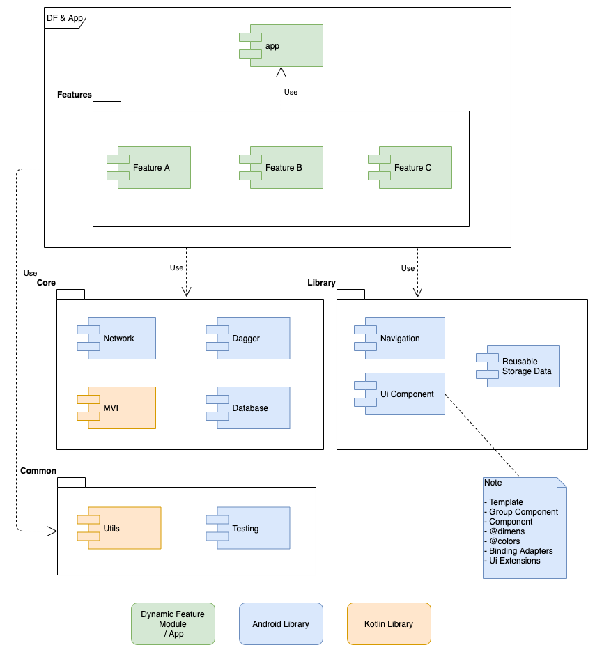

Modularization Sample 
=====================

This is a Modularization project sample that combines Dynamic Features, Clean Architecture, Model View Intent (MVI)
with Kotlin Flow, Jetpack Navigation, Dagger, Retrofit, Room (working), Dynamic Navigator library.

First of all
------------
Check out these articles, projects samples and videos
+ [Jeroen Mols](https://jeroenmols.com/): 
	+ [Modularization - Why you should care](https://jeroenmols.com/blog/2019/03/06/modularizationwhy/)
	+ [Modularization - A successful architecture](https://jeroenmols.com/blog/2019/03/18/modularizationarchitecture/)
	+ [Modularization - Real-life example](https://jeroenmols.com/blog/2019/04/02/modularizationexample/)
	+ [Modularization - How to approach](https://jeroenmols.com/blog/2019/04/24/modularizationhow/)
	+ [Modularization - Lessons learned](https://jeroenmols.com/blog/2019/06/12/modularizationtips/)
	+ [Mobiconf 2019 - Succesfully modularising your app](https://youtu.be/9eikhwWehWk?t=1)
	+ [Github Modularization Example](https://github.com/JeroenMols/ModularizationExample)
+ Ben Schwab: [Scaling an Android App from 1 to 100 developers with modularization](https://youtu.be/jrnhIgFzgns)
+ Ben Weiss:
  - [Modularization for dynamic delivery](https://www.droidcon.com/media-detail?video=352671532)
  - [Patchwork Plaid — A modularization story](https://medium.com/androiddevelopers/a-patchwork-plaid-monolith-to-modularized-app-60235d9f212e)
  - [Dependency injection in a multi module project](https://medium.com/androiddevelopers/dependency-injection-in-a-multi-module-project-1a09511c14b7)
+ Marcos Holgado: [Why we failed at modularizing our app. An honest retrospective.](https://www.droidcon.com/media-detail?video=352670401)
+ [Github Plaid](https://github.com/android/plaid)

Description
-----------
A browser of movies

Architecture
------------
This is an approach of Clean Architecture by features  

### Clean Architecture

